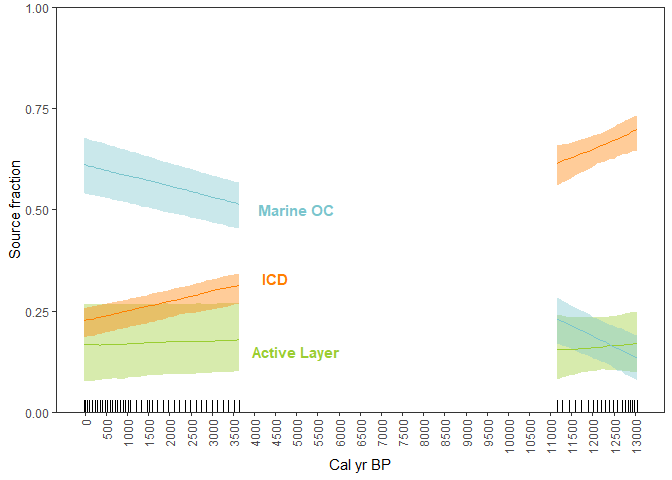
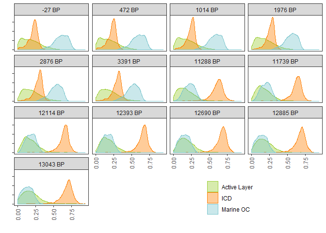

Code for reproducing source apportionment in [Martens et.al. (2019)
*Global Biogeochemical Cycles*, 33,
2-14](https://agupubs.onlinelibrary.wiley.com/doi/full/10.1029/2018GB005969)
================

### Statistical model

See article supporting information for model details implemented in
[`model.jags`](model.jags).

### Preparation

``` r
library(tidyverse)
library(readxl)
library(rjags)
library(cowplot)
# Data file downloaded from Bolin center database 2019-02-15 using
# download.file("https://bolin.su.se/data/uploads/Martens-2018-3.xlsx", destfile = "Martens-2018-3.xlsx", mode = "wb")
isotope_data <- read_excel("Martens-2018-3.xlsx", 
                           sheet = "S3", range = "A3:H64",
                           col_names = c("depth", "age", "OC", "d13C", "OC_flux", "lab", "D14C_raw", "D14C_corrected")) %>% 
  select(age, d13C, D14C = D14C_corrected)
# End member values from Article SI tables S6-S9
end_members <- read_csv("end_members.csv")
knitr::kable(end_members)
```

| Variable | Source   | Isotope |   value | SI\_table |
| :------- | :------- | :------ | ------: | :-------- |
| mean     | ICD      | d13C    |  \-26.3 | S7        |
| s.d.     | ICD      | d13C    |     1.3 | S7        |
| mean     | TS       | d13C    |  \-27.1 | S6        |
| s.d.     | TS       | d13C    |     1.0 | S6        |
| mean     | M\_Young | d13C    |  \-21.0 | S9        |
| s.d.     | M\_Young | d13C    |     2.6 | S9        |
| mean     | M\_old   | d13C    |  \-22.7 | S8        |
| s.d.     | M\_old   | d13C    |     3.5 | S8        |
| mean     | ICD      | D14C    | \-962.0 | S7        |
| s.d.     | ICD      | D14C    |    61.0 | S7        |
| mean     | TS       | D14C    | \-173.0 | S6        |
| s.d.     | TS       | D14C    |   163.0 | S6        |
| mean     | M\_Young | D14C    |  \-50.0 | S9        |
| s.d.     | M\_Young | D14C    |    12.0 | S9        |
| mean     | M\_old   | D14C    |  \-16.0 | S8        |
| s.d.     | M\_old   | D14C    |    53.0 | S8        |

``` r
# Helper functions
source("functions.R")
```

### Model fitting using MCMC (JAGS)

``` r
# Parameters for MCMC
N <- 1000000
thin <- 1000
# Young part of the core
isotopes_young <- filter(isotope_data, age < 8000)
em_young <- filter(end_members, Source != "M_old")
# Run MCMC on young part
out_young <-  run_jags(isotopes_young, "model.jags", em_young, N, thin)

# Old part of the core
isotopes_old <- filter(isotope_data, age > 10000)
em_old <- filter(end_members, Source != "M_young")
# Run MCMC on young part
out_old <-  run_jags(isotopes_old, "model.jags", em_old, N, thin)
```

### Visualisation of results

``` r
plot_p(out_young, out_old, isotopes_young, isotopes_old) +
        annotate("text", x = c(5000, 4500, 5000), y = c(0.15, 0.33, 0.5), 
                 color = c("olivedrab3", "darkorange1", "cadetblue3"),
                 label = c("Active Layer", "ICD", "Marine OC"),
                 fontface="bold")
```

<!-- -->

Posterior median proportions with 50% credibility regions.

``` r
plot_p2(out_young, out_old, isotopes_young, isotopes_old) 
```

<!-- -->

Posterior proportion densities at D14C sampling ages.

``` r
sessionInfo()
```

    ## R version 3.5.1 (2018-07-02)
    ## Platform: x86_64-w64-mingw32/x64 (64-bit)
    ## Running under: Windows 10 x64 (build 17763)
    ## 
    ## Matrix products: default
    ## 
    ## locale:
    ## [1] LC_COLLATE=Swedish_Sweden.1252  LC_CTYPE=Swedish_Sweden.1252   
    ## [3] LC_MONETARY=Swedish_Sweden.1252 LC_NUMERIC=C                   
    ## [5] LC_TIME=Swedish_Sweden.1252    
    ## 
    ## attached base packages:
    ## [1] stats     graphics  grDevices utils     datasets  methods   base     
    ## 
    ## other attached packages:
    ##  [1] readxl_1.1.0    bindrcpp_0.2.2  cowplot_0.9.3   rjags_4-8      
    ##  [5] coda_0.19-2     forcats_0.3.0   stringr_1.3.1   dplyr_0.7.8    
    ##  [9] purrr_0.2.5     readr_1.2.1     tidyr_0.8.2     tibble_2.0.1   
    ## [13] ggplot2_3.1.0   tidyverse_1.2.1
    ## 
    ## loaded via a namespace (and not attached):
    ##  [1] tidyselect_0.2.5 haven_2.0.0      lattice_0.20-35  colorspace_1.3-2
    ##  [5] generics_0.0.2   htmltools_0.3.6  yaml_2.2.0       rlang_0.3.1     
    ##  [9] pillar_1.3.1     glue_1.3.0       withr_2.1.2      modelr_0.1.2    
    ## [13] bindr_0.1.1      plyr_1.8.4       munsell_0.5.0    gtable_0.2.0    
    ## [17] cellranger_1.1.0 rvest_0.3.2      codetools_0.2-15 evaluate_0.12   
    ## [21] labeling_0.3     knitr_1.20       broom_0.5.1      Rcpp_1.0.0      
    ## [25] scales_1.0.0     backports_1.1.2  jsonlite_1.6     hms_0.4.2       
    ## [29] digest_0.6.18    stringi_1.2.4    grid_3.5.1       cli_1.0.1       
    ## [33] tools_3.5.1      magrittr_1.5     lazyeval_0.2.1   crayon_1.3.4    
    ## [37] pkgconfig_2.0.2  xml2_1.2.0       lubridate_1.7.4  rematch_1.0.1   
    ## [41] assertthat_0.2.0 rmarkdown_1.11   httr_1.3.1       rstudioapi_0.8  
    ## [45] R6_2.3.0         nlme_3.1-137     compiler_3.5.1
